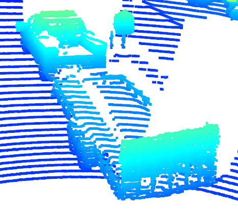
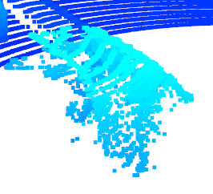
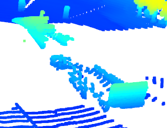
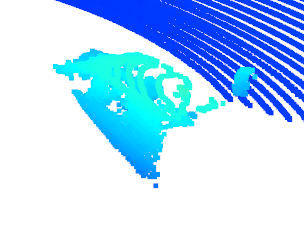

# Writeup: 3D Object Detection

Please use this starter template to answer the following questions:

### 1. Find and display 10 examples of vehicles with varying degrees of visibility in the point-cloud

### 2. Identify vehicle features that appear as a stable feature on most vehicles (e.g. rear-bumper, tail-lights) and describe them briefly. Also, use the range image viewer from the last example to underpin your findings using the lidar intensity channel.

Tail-gate, rear and front bumpers, side bodies, basically any part of the vehicles that are contiguous and non-transparent seem to be the most stable features. These also show the largest intensities. 

